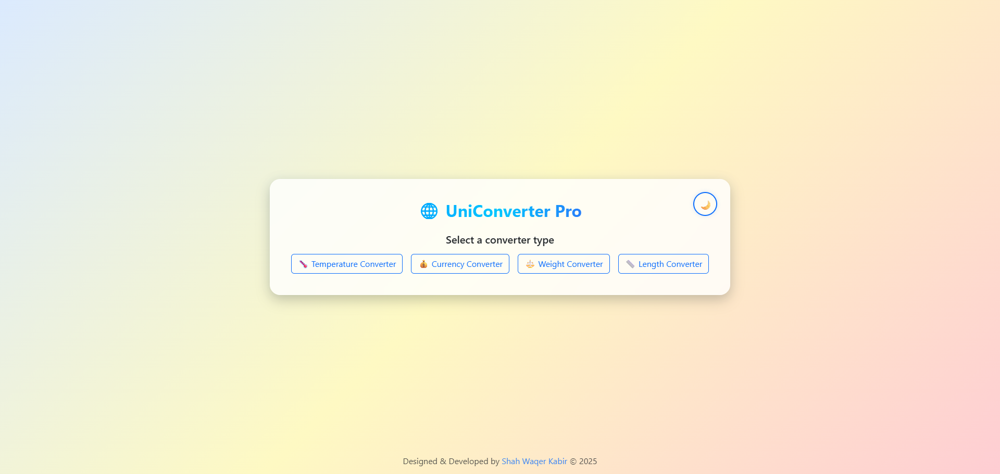
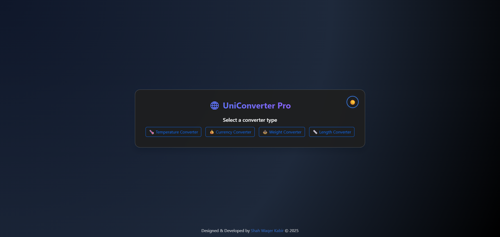
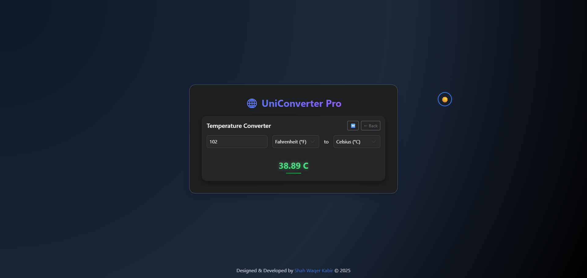
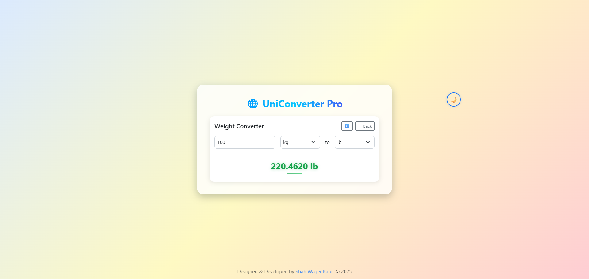

# 🧮 UniConvert Pro

**UniConvert Pro** is a modern, responsive, and theme-adaptive unit conversion app built with **React + TypeScript + Bootstrap 5**.  
It allows users to easily convert between multiple unit types — including **Temperature, Currency, Weight, and Length** — all in one elegant interface.

---

## 🌟 Features

✅ **🌗 Dark / Light Mode** — smooth theme transitions  
✅ **🔁 Swap Button** — instantly reverse conversion direction  
✅ **💰 Live Currency Rates** — powered by ExchangeRate API  
✅ **🧠 Modular Converters** — Temperature, Currency, Weight, Length  
✅ **💻 Built with React 18 + TypeScript + Bootstrap 5**  
✅ **⚡ Fast & Responsive** — mobile-friendly and optimized UI  
✅ **🎨 Beautiful Animated Interface** — with gradients and shadows  

---

## 🛠️ Tech Stack

| Category | Tools / Libraries |
|-----------|-------------------|
| **Framework** | React + TypeScript |
| **Styling** | Bootstrap 5, Custom CSS |
| **API** | ExchangeRate.host |
| **Build Tool** | Vite |
| **Package Manager** | npm / yarn |

---

## 🚀 Getting Started

### 1️⃣ Clone the repository
```bash
git clone https://github.com/<your-username>/uniconvert-pro.git
cd uniconvert-pro
2️⃣ Install dependencies
bash
Copy code
npm install
3️⃣ Set up environment variables
Create a .env file in the root directory:

bash
Copy code
VITE_CURRENCY_API_KEY=your_api_key_here
4️⃣ Run the app
bash
Copy code
npm run dev
5️⃣ Build for production
bash
Copy code
npm run build
📂 Folder Structure
css
Copy code
src/
├── components/
│   ├── ConverterCard.tsx
│   ├── ConverterSelector.tsx
│   └── UnitConverter.tsx
├── converters/
│   ├── CurrencyConverter.tsx
│   ├── TemperatureConverter.tsx
│   ├── WeightConverter.tsx
│   └── LengthConverter.tsx
├── hooks/
│   └── useCurrencyRates.ts
├── App.tsx
├── main.tsx
└── index.css

🖼️ Screenshots






👨‍💻 Author
Designed & Developed by Shah Waqer Kabir
© 2025 UniConvert Pro — All Rights Reserved.

💡 Future Improvements
📏 Add more converters (Volume, Speed, Time)
🌍 Multi-language support
💾 Offline caching for last fetched currency rates
🔊 Voice input & accessibility features (experimental)

⭐ If you like this project, give it a star on GitHub!
yaml
Copy code

---

### 🧩 How to use this:
1. Create a folder named `Demo` in your project root.  
2. Move your screenshots (`1.png`, `2.png`, `3.png`, `4.png`) into that folder.  
3. Save the above content as `README.md`.  
4. Then commit and push it:
   ```bash
   git add README.md Demo/
   git commit -m "📘 Added professional README with screenshots"
   git push
